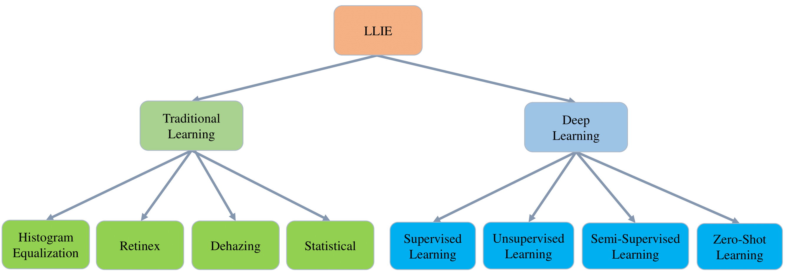
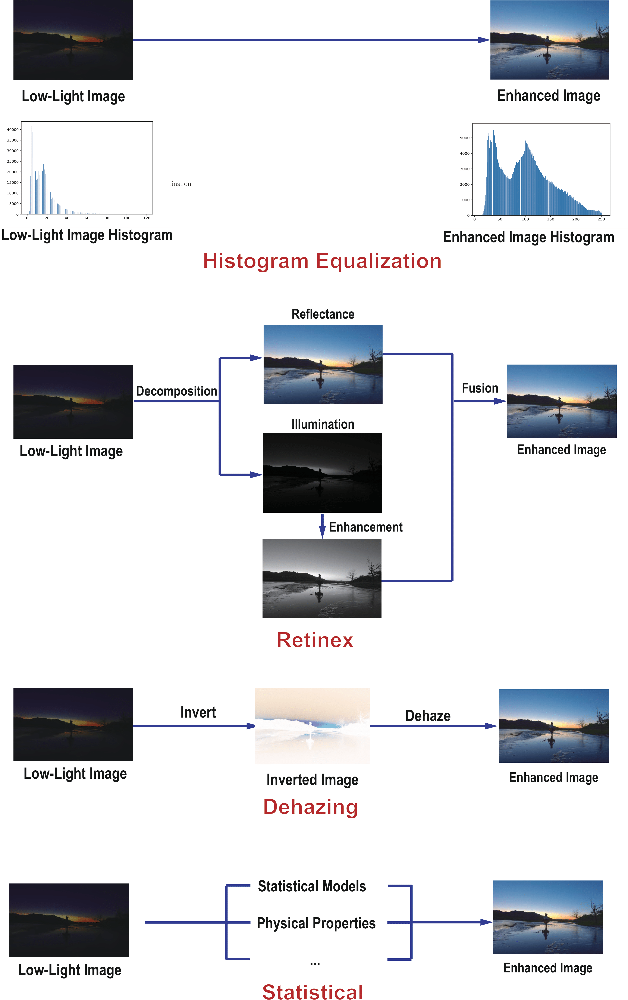
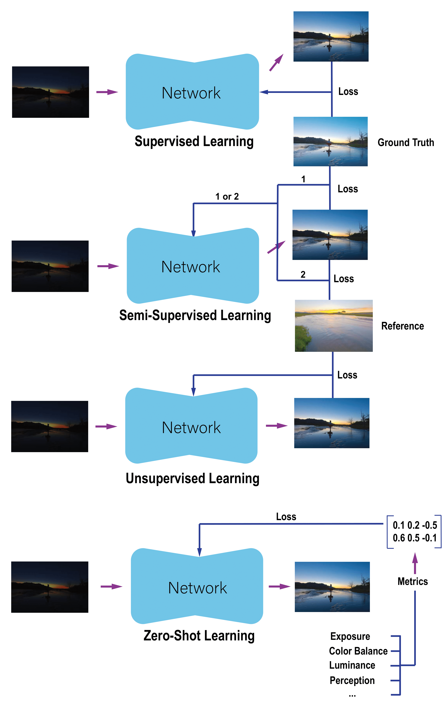

This is a repository that contains resources accompanying our paper "Low-Light Image and Video Enhancement: A
Comprehensive Survey and Beyond" [[arxiv](https://arxiv.org/pdf/2212.10772.pdf)]

[](https://awesome.re)

 Updates
- 2023/4/16: The enhanced images and the metric scripts have been uploaded.
- 2023/3/24: The Night Wenzhou Dataset has been uploaded.
- 2023/2/8: The arxiv has been updated. The current version contains 21 pages, 9 tables, and 25 figures!


# Abstract

This paper presents a comprehensive survey of low-light image and video enhancement. We begin with the challenging mixed over-/under-exposed images, which are under-performed by existing methods. To this end, we propose two variants of the SICE dataset named SICE\_Grad and SICE\_Mix. Next, we introduce Night Wenzhou, a large-scale, high-resolution video dataset, to address the lack of low-light video datasets that discourages the use of low-light image enhancement (LLIE) methods in videos. Our Night Wenzhou dataset is challenging since it consists of fast-moving aerial scenes and streetscapes with varying illuminations and degradation. We then construct a hierarchical taxonomy, conduct extensive key technique analysis, and performs experimental comparisons for representative LLIE approaches using our proposed datasets and the current benchmark datasets. Finally, we identify emerging applications, address unresolved challenges, and propose future research topics for the LLIE community.

# Timeline

<p float="left">
<p align="middle">
  
</p>


# Taxonomy

<p float="left">
<p align="middle">
  
</p>

# Category


Traditional Learning          |  Deep Learning
:-------------------------:|:-------------------------:
  |  


# Models (in chronological order) 

* **PIE** (TIP 2015) [[paper](https://ieeexplore.ieee.org/document/7229296)] [[Python](https://github.com/DavidQiuChao/PIE)]
  * A Probabilistic Method for Image Enhancement With Simultaneous Illumination and Reflectance Estimation

* **LIME** (TIP 2016) [[paper](https://ieeexplore.ieee.org/document/7782813)] [[Python](https://github.com/pvnieo/Low-light-Image-Enhancement)]
  * LIME: Low-Light Image Enhancement via Illumination Map Estimation

* **LLNet** (PR 2017) [[paper](https://arxiv.org/pdf/1511.03995.pdf)] [[Theano](https://github.com/kglore/llnet_color)]
  * LLNet: A Deep Autoencoder Approach to Natural Low-light Image Enhancement

* **MBLLEN** (BMVC 2017) [[paper](http://bmvc2018.org/contents/papers/0700.pdf)] [[Keras](https://github.com/Lvfeifan/MBLLEN)]
  * MBLLEN: Low-light Image/Video Enhancement Using CNNs

* **LightenNet** (PRL 2018) [[paper](https://www.sciencedirect.com/science/article/abs/pii/S0167865518300163)] [[MATLAB](https://li-chongyi.github.io/proj_lowlight.html)]
  * LightenNet: A Convolutional Neural Network for weakly illuminated image enhancement

* **Retinex-Net** (BMVC 2018) [[paper](https://arxiv.org/pdf/1808.04560.pdf)] [[TensorFlow](https://github.com/weichen582/RetinexNet)]
  * Deep Retinex Decomposition for Low-Light Enhancement

* **SID** (CVPR 2018) [[paper](https://arxiv.org/pdf/1805.01934.pdf)] [[TensorFlow](https://github.com/cchen156/Learning-to-See-in-the-Dark)]
  * Learning to See in the Dark

* **DeepUPE** (CVPR 2019) [[paper](https://openaccess.thecvf.com/content_CVPR_2019/papers/Wang_Underexposed_Photo_Enhancement_Using_Deep_Illumination_Estimation_CVPR_2019_paper.pdf)] [[TensorFlow](https://github.com/dvlab-research/DeepUPE)]
  * Underexposed Photo Enhancement using Deep Illumination Estimation

* **EEMEFN** (AAAI 2019) [[paper](https://aaai.org/ojs/index.php/AAAI/article/view/7013/6867)] [[TensorFlow](https://github.com/MinfengZhu/EEMEFN)]
  * EEMEFN: Low-Light Image Enhancement via Edge-Enhanced Multi-Exposure Fusion Network

* **ExCNet** (ACMMM 2019) [[paper](https://dl.acm.org/doi/10.1145/3343031.3351069)] [[Tensorflow ](https://cslinzhang.github.io/ExCNet/)]
  * Zero-shot restoration of back-lit images using deep internal learning

* **KinD** (ACMMM 2019) [[paper](https://dl.acm.org/doi/pdf/10.1145/3343031.3350926?casa_token=yevJKszgeQQAAAAA:0IAtZu-twlF45auctc3zbM0ghRBrf0KoFgbCTZALFL6xMlFQXvBVB4Ft1728JLj-FRifaGgykmWD)] [[TensorFlow](https://github.com/zhangyhuaee/KinD)]
  * Kindling the darkness: A practical low-light image enhancer

* **Zero-DCE** (CVPR 2020) [[paper](https://openaccess.thecvf.com/content_CVPR_2020/papers/Guo_Zero-Reference_Deep_Curve_Estimation_for_Low-Light_Image_Enhancement_CVPR_2020_paper.pdf)] [[PyTorch](https://github.com/Li-Chongyi/Zero-DCE)]
  * Zero-reference deep curve estimation for low-light image enhancement

* **DRBN** (CVPR 2020) [[paper](https://openaccess.thecvf.com/content_CVPR_2020/papers/Yang_From_Fidelity_to_Perceptual_Quality_A_Semi-Supervised_Approach_for_Low-Light_CVPR_2020_paper.pdf)] [[PyTorch](https://github.com/flyywh/CVPR-2020-Semi-Low-Light)] 
  * From Fidelity to Perceptual Quality: A Semi-Supervised Approach for
Low-Light Image Enhancement

* **Xu et al.** (CVPR 2020) [[paper](https://openaccess.thecvf.com/content_CVPR_2020/papers/Xu_Learning_to_Restore_Low-Light_Images_via_Decomposition-and-Enhancement_CVPR_2020_paper.pdf)] [[PyTorch](https://drive.google.com/drive/folders/1L3RDbd3sk_TcMTrSmZXn8KLg8opjOjf0)]
  * Learning to Restore Low-Light Images via Decomposition-and-Enhancement

* **DLN** (TIP 2020) [[paper](https://ieeexplore.ieee.org/document/9141197)] [[PyTorch](https://github.com/WangLiwen1994/DLN)]
  * Lightening network for low-light image enhancement

* **DeepLPF** (CVPR 2020) [[paper](https://openaccess.thecvf.com/content_CVPR_2020/papers/Moran_DeepLPF_Deep_Local_Parametric_Filters_for_Image_Enhancement_CVPR_2020_paper.pdf)] [[PyTorch](https://github.com/sjmoran/DeepLPF)]
  * Deep Local Parametric Filters for Image Enhancement 

* **EnlightenGAN** (TIP 2021) [[paper](https://arxiv.org/pdf/1906.06972.pdf)] [[PyTorch](https://github.com/VITA-Group/EnlightenGAN)]
  * EnlightenGAN: Deep Light Enhancement without Paired Supervision

* **KinD++** (IJCV 2021) [[paper](https://link.springer.com/article/10.1007/s11263-020-01407-x)] [[TensorFlow](https://github.com/zhangyhuaee/KinD_plus)]
  * Beyond Brightening Low-light Images

* **Zero-DCE++** (TPAMI 2021) [[paper](https://arxiv.org/pdf/2103.00860.pdf)] [[PyTorch](https://github.com/Li-Chongyi/Zero-DCE_extension)]
  * Learning to enhance low-light image via zero-reference deep curve estimation

* **Zhang et al.** (CVPR 2021) [[paper](https://openaccess.thecvf.com/content/CVPR2021/papers/Zhang_Learning_Temporal_Consistency_for_Low_Light_Video_Enhancement_From_Single_CVPR_2021_paper.pdf)] [[PyTorch](https://github.com/zkawfanx/StableLLVE)]
  * Learning Temporal Consistency for Low Light Video Enhancement from Single Images

* **RUAS** (CVPR 2021) [[paper](https://openaccess.thecvf.com/content/CVPR2021/papers/Liu_Retinex-Inspired_Unrolling_With_Cooperative_Prior_Architecture_Search_for_Low-Light_Image_CVPR_2021_paper.pdf)] [[PyTorch](https://github.com/KarelZhang/RUAS)]
  * Retinex-inspired Unrolling with Cooperative Prior Architecture Search for Low-light Image Enhancement

* **UTVNet** (ICCV 2021) [[paper](https://openaccess.thecvf.com/content/ICCV2021/papers/Zheng_Adaptive_Unfolding_Total_Variation_Network_for_Low-Light_Image_Enhancement_ICCV_2021_paper.pdf)] [[PyTorch](https://github.com/CharlieZCJ/UTVNet)]
  * UTVNet: Adaptive Unfolding Total Variation Network for Low-Light Image Enhancement

* **SDSD** (ICCV 2021) [[paper](https://openaccess.thecvf.com/content/ICCV2021/papers/Wang_Seeing_Dynamic_Scene_in_the_Dark_A_High-Quality_Video_Dataset_ICCV_2021_paper.pdf)] [[PyTorch](https://github.com/dvlab-research/SDSD)]
  * Seeing Dynamic Scene in the Dark: A High-Quality Video Dataset with Mechatronic Alignment

* **RetinexDIP** (TCSVT 2021) [[paper](https://ieeexplore.ieee.org/document/9405649)] [[PyTorch](https://github.com/zhaozunjin/RetinexDIP)]
  * RetinexDIP: A Unified Deep Framework for Low-light Image Enhancement

* **SGZ** (WACV 2022) [[paper](https://openaccess.thecvf.com/content/WACV2022W/RWS/papers/Zheng_Semantic-Guided_Zero-Shot_Learning_for_Low-Light_ImageVideo_Enhancement_WACVW_2022_paper.pdf)] [[PyTorch](https://github.com/ShenZheng2000/Semantic-Guided-Low-Light-Image-Enhancement)]
  * Semantic-Guided Zero-Shot Learning for Low-Light Image/Video Enhancement

* **LLFlow** (AAAI 2022) [[paper](https://arxiv.org/pdf/2109.05923.pdf)] [[PyTorch](https://github.com/wyf0912/LLFlow)]
  * Low-Light Image Enhancement with Normalizing Flow

* **SNR-Aware** (CVPR 2022) [[paper](https://openaccess.thecvf.com/content/CVPR2022/papers/Xu_SNR-Aware_Low-Light_Image_Enhancement_CVPR_2022_paper.pdf)] [[PyTorch](https://github.com/dvlab-research/SNR-Aware-Low-Light-Enhance)]
  * SNR-Aware Low-light Image Enhancement

* **SCI** (CVPR 2022) [[paper](https://openaccess.thecvf.com/content/CVPR2022/papers/Ma_Toward_Fast_Flexible_and_Robust_Low-Light_Image_Enhancement_CVPR_2022_paper.pdf)] [[PyTorch](https://github.com/vis-opt-group/SCI)]
  * Toward Fast, Flexible, and Robust Low-Light Image Enhancement

* **URetinex-Net** (CVPR 2022) [[paper](https://openaccess.thecvf.com/content/CVPR2022/papers/Wu_URetinex-Net_Retinex-Based_Deep_Unfolding_Network_for_Low-Light_Image_Enhancement_CVPR_2022_paper.pdf)] [[PyTorch](https://github.com/AndersonYong/URetinex-Net)]
  * URetinex-Net: Retinex-based Deep Unfolding Network for Low-light Image Enhancement

* **Dong et al.** (CVPR 2022) [[paper](https://openaccess.thecvf.com/content/CVPR2022/papers/Dong_Abandoning_the_Bayer-Filter_To_See_in_the_Dark_CVPR_2022_paper.pdf)] [[PyTorch](https://github.com/TCL-AILab/Abandon_Bayer-Filter_See_in_the_Dark)]
  * Abandoning the Bayer-Filter to See in the Dark

* **MAXIM** (CVPR 2022) [[paper](https://openaccess.thecvf.com/content/CVPR2022/papers/Tu_MAXIM_Multi-Axis_MLP_for_Image_Processing_CVPR_2022_paper.pdf)] [[Jax](https://github.com/google-research/maxim)]
  * MAXIM: Multi-Axis MLP for Image Processing

* **BIPNet** (CVPR 2022) [[paper](https://openaccess.thecvf.com/content/CVPR2022/papers/Dudhane_Burst_Image_Restoration_and_Enhancement_CVPR_2022_paper.pdf)] [[PyTorch](https://github.com/akshaydudhane16/BIPNet)]
  * Burst Image Restoration and Enhancement

* **LCDPNet** (ECCV 2022) [[paper](https://www.ecva.net/papers/eccv_2022/papers_ECCV/papers/136780336.pdf)] [[PyTorch](https://github.com/onpix/LCDPNet)]
  * Local Color Distributions Prior for Image Enhancement

* **IAT** (BMVC 2022) [[paper](https://arxiv.org/pdf/2205.14871.pdf)] [[PyTorch](https://github.com/cuiziteng/Illumination-Adaptive-Transformer)]
  * You Only Need 90K Parameters to Adapt Light: A Light Weight Transformer for Image Enhancement and Exposure Correction


# Benchmark Datasets 

* NPE, LIME, MEF, DICM, VV [[link](https://drive.google.com/drive/folders/1lp6m5JE3kf3M66Dicbx5wSnvhxt90V4T)]

* LOL [[link](https://daooshee.github.io/BMVC2018website/)]

* VE-LOL [[link](https://flyywh.github.io/IJCV2021LowLight_VELOL/)]

* ACDC [[link](https://acdc.vision.ee.ethz.ch/)]

* DCS [[link](https://github.com/ShenZheng2000/DarkCityScape_mIOU_mPA)]

* DarkFace [[link](https://flyywh.github.io/CVPRW2019LowLight/)]

* ExDark [[link](https://github.com/cs-chan/Exclusively-Dark-Image-Dataset)]

* SICE [[link](https://github.com/csjcai/SICE)]


# Our Datasets 

* SICE_Grad & SICE_Mix [[images](https://drive.google.com/file/d/1gii4AEyyPp_kagfa7TyugnNPvUhkX84x/view?usp=sharing)]

* Night Wenzhou [[videos](https://drive.google.com/file/d/1kRsszLDx1KKx6XHeLFfogDJUO62GNLAc/view?usp=drive_link)] 


# Enhanced Images

* Enhanced images for all baselines are [here](https://drive.google.com/file/d/1lSjZRJi4pOaI0auyB8UjPtTAGSb6UpkT/view?usp=share_link)


# Metrics

## Full-Reference

* [PSNR](https://github.com/ShenZheng2000/LLIE_Survey/blob/main/Metric/ref.py)

* [SSIM](https://github.com/ShenZheng2000/LLIE_Survey/blob/main/Metric/ref.py)

* [LPIPS](https://github.com/ShenZheng2000/LLIE_Survey/blob/main/Metric/ref.py)

## Non-Reference 

* [UNIQUE](https://github.com/zwx8981/UNIQUE)

* [BRISQUE](https://github.com/ShenZheng2000/LLIE_Survey/blob/main/Metric/BRISQUE.py)

* [SPAQ](https://github.com/ShenZheng2000/LLIE_Survey/blob/main/Metric/SPAQ.py)

## Subjective

* User Study 

## Efficiency

* [FLOPs](https://github.com/ShenZheng2000/LLIE_Survey/blob/main/Metric/eff_score.py)

* [#Params](https://github.com/ShenZheng2000/LLIE_Survey/blob/main/Metric/eff_score.py)

* [Run Time](https://github.com/ShenZheng2000/LLIE_Survey/blob/main/Metric/eff_score.py)


# Surveys

* IEEE [[paper](https://ieeexplore.ieee.org/document/9088214)]
  * An experiment-based review of low-light image enhancement methods

* IJCV 2021 [[paper](https://flyywh.github.io/IJCV2021LowLight_VELOL/attached_files/ijcv21.pdf)]
  * Benchmarking low-light image enhancement and beyond

* TPAMI 2021 [[paper](https://arxiv.org/pdf/2104.10729.pdf)]
  * Low-Light Image and Video Enhancement Using Deep Learning: A Survey


# Related Repositories

* [[Low-Light Image and Video Enhancement Using Deep Learning: A Survey](https://github.com/Li-Chongyi/Lighting-the-Darkness-in-the-Deep-Learning-Era-Open)]

* [[Awesome Low Light Image Enhancement](https://github.com/dawnlh/awesome-low-light-image-enhancement)]

* [[Awesome-Low-Light-Enhancement](https://github.com/Elin24/Awesome-Low-Light-Enhancement)]


# BibTeX

If you find this repository helpful, please cite our paper. 

```
@article{zheng2022low,
  title={Low-Light Image and Video Enhancement: A Comprehensive Survey and Beyond},
  author={Zheng, Shen and Ma, Yiling and Pan, Jinqian and Lu, Changjie and Gupta, Gaurav},
  journal={arXiv preprint arXiv:2212.10772},
  year={2022}
}
```


